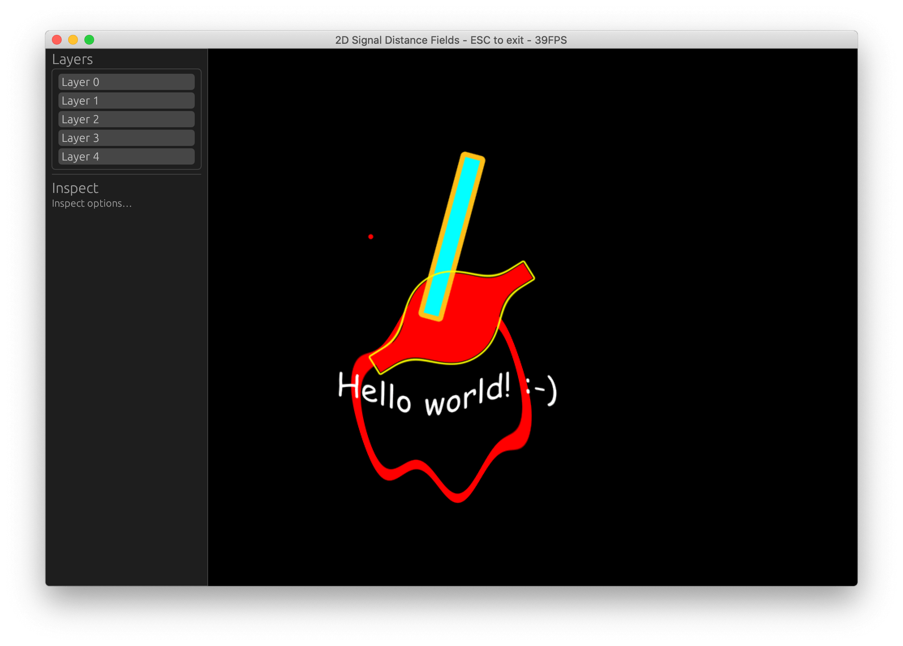

# 2D Signed Distance Fields

This is a toy project to learn some Rust. It's unfinished, and that's probably how it'll stay. In the future I might finish the editor. 😅

Details:

- CPU rendered [2d signed distance fields](https://www.iquilezles.org/www/articles/distfunctions2d/distfunctions2d.htm).
  - Text rendered using SDFs loaded [from a texture](./comic-sans.png).
- Parallelized using [Rayon](https://github.com/rayon-rs/rayon).
- Canvas handled with [pixels](https://github.com/parasyte/pixels).
- GUI using [egui](https://github.com/emilk/egui).
